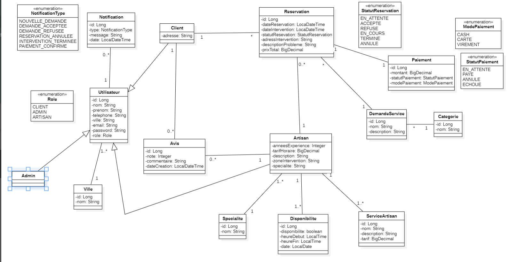
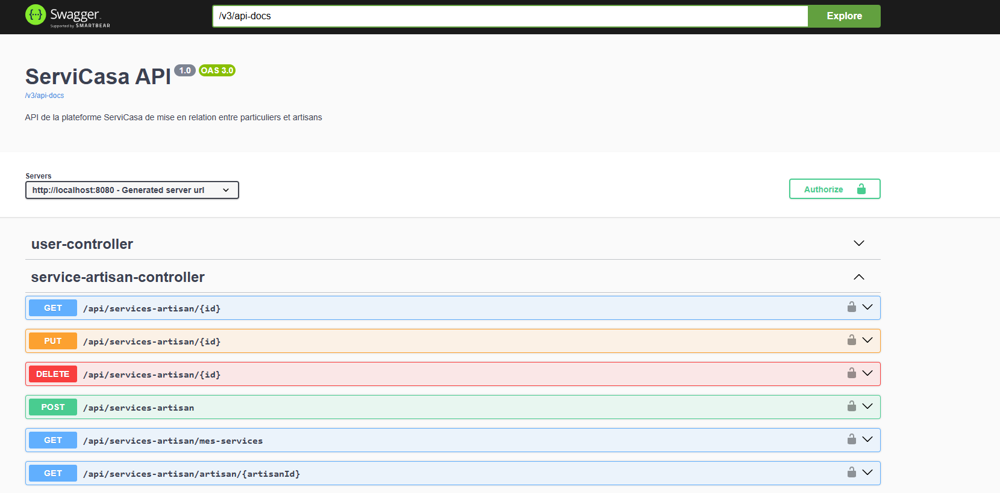
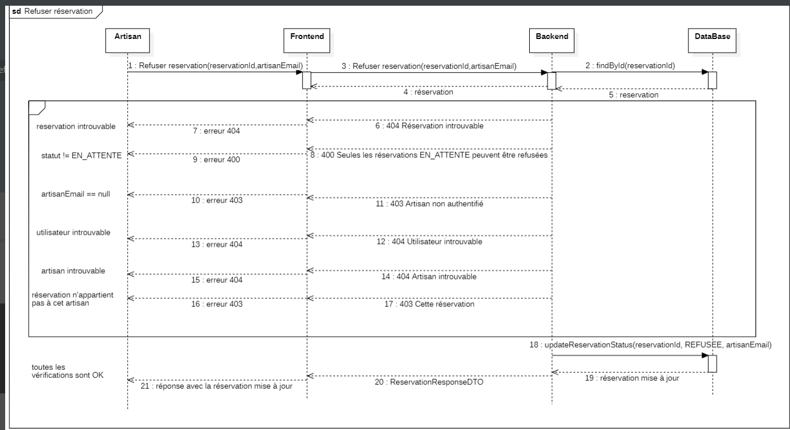

# ServiCasa --- Backend

## 1. Nom du projet

**ServiCasa --- Backend**

Backend de la plateforme web **ServiCasa**, développée pour mettre en
relation des clients avec des artisans et permettre la gestion des
demandes de services, réservations, paiements, avis et notifications.

------------------------------------------------------------------------

## 2. Présentation

Le backend de ServiCasa fournit une API REST permettant au frontend de
communiquer avec la base de données et d'exécuter les principales
opérations métier.

Il assure notamment :

-   l'authentification et la gestion des utilisateurs ;
-   la gestion des clients et des artisans ;
-   la gestion des catégories, spécialités et services artisans ;
-   la gestion des demandes de services ;
-   la création et le suivi des réservations ;
-   la gestion des paiements ;
-   la gestion des avis entre clients et artisans ;
-   la gestion des disponibilités ;
-   la gestion des notifications ;
-   la validation des règles métier et la gestion des erreurs.

------------------------------------------------------------------------

## 3. Architecture Backend

Le backend suit une architecture en couches afin de séparer les
responsabilités :

``` text
Controller
    ↓
Service
    ↓
Repository
    ↓
Entity
    ↓
MySQL
```

### Rôle des couches

-   **Controller** : expose les endpoints REST.
-   **Service** : contient la logique métier.
-   **Repository** : assure l'accès aux données avec Spring Data JPA.
-   **Entity** : représente les tables et relations de la base de
    données.
-   **DTO** : permet de contrôler les données échangées entre le
    frontend et le backend.
-   **MySQL** : stocke les données de l'application.
-   **Flyway** : versionne et applique les migrations de base de
    données.

------------------------------------------------------------------------

## 4. Technologies utilisées

Technologie               Utilisation
  ------------------------- ----------------------------------
Java                      Langage principal
Spring Boot               Framework backend
Spring Web                API REST
Spring Data JPA           Persistance et accès aux données
Hibernate                 ORM
MySQL                     Base de données
Flyway                    Migrations de base de données
Maven                     Gestion des dépendances et build
Lombok                    Réduction du code répétitif
Docker / Docker Compose   Environnement de base de données
Swagger / OpenAPI         Documentation et test de l'API
Git / GitHub              Versionnement

------------------------------------------------------------------------

## 5. Structure du backend

Une organisation typique du projet est basée sur les couches suivantes :

``` text
src/
└── main/
    ├── java/
    │   └── ServiCasa/
    │       ├── controller/
    │       ├── service/
    │       ├── repository/
    │       ├── entity/
    │       ├── dto/
    │       ├── exception/
    │       └── config/
    │
    └── resources/
        ├── application.properties
        └── db/
            └── migration/
```

------------------------------------------------------------------------

# 6. Modèle de données

Le modèle backend contient notamment les entités suivantes :

-   `Utilisateur`
-   `Client`
-   `Artisan`
-   `Admin`
-   `Reservation`
-   `Avis`
-   `DemandeService`
-   `Categorie`
-   `ServiceArtisan`
-   `Specialite`
-   `Disponibilite`
-   `Paiement`
-   `Notification`
-   `Ville`

Les énumérations utilisées dans le modèle comprennent notamment :

-   `Role`
-   `StatutReservation`
-   `StatutPaiement`
-   `ModePaiement`
-   `NotificationType`

------------------------------------------------------------------------

## 7. Diagramme de classes

Le diagramme de classes présente les principales entités du domaine
ainsi que leurs relations et cardinalités.


### Principales relations représentées

-   Un **Client** peut effectuer plusieurs réservations.
-   Une **Réservation** est associée à un artisan.
-   Une **Réservation** peut être associée à un paiement.
-   Une **Réservation** concerne une demande de service.
-   Une **DemandeService** appartient à une catégorie.
-   Un **Artisan** possède des services, des spécialités et des
    disponibilités.
-   Un **Client** peut publier des avis concernant des artisans.
-   Les notifications sont associées aux utilisateurs.
-   Les rôles et statuts sont représentés par des énumérations.

------------------------------------------------------------------------

# 8. API REST

L'API permet au frontend d'accéder aux fonctionnalités du backend.

Les principales ressources sont organisées autour de :

``` text
/api/auth
/api/users
/api/clients
/api/artisans
/api/services-artisan
/api/reservations
/api/avis
...
```

Les opérations REST utilisent principalement :

-   `GET` : récupération des données ;
-   `POST` : création ;
-   `PUT` : modification ;
-   `DELETE` : suppression.

------------------------------------------------------------------------

# 9. Swagger / OpenAPI

L'API est documentée avec **Swagger / OpenAPI**.

Swagger permet de :

-   visualiser les endpoints disponibles ;
-   consulter les paramètres des requêtes ;
-   consulter les réponses ;
-   tester directement les endpoints ;
-   vérifier les opérations protégées par authentification.

### Exemple de documentation Swagger


L'interface Swagger affiche notamment les contrôleurs et leurs endpoints
REST, par exemple les opérations liées aux services artisans.

------------------------------------------------------------------------

## 10. Accès à Swagger

Après le démarrage du backend, Swagger UI est accessible avec :

``` text
http://localhost:8080/swagger-ui/index.html
```

La documentation OpenAPI est généralement disponible via :

``` text
http://localhost:8080/v3/api-docs
```

------------------------------------------------------------------------

# 11. Réservations

Le système de réservation permet notamment de :

1.  créer une réservation ;
2.  consulter une réservation ;
3.  modifier son statut ;
4.  accepter ou refuser une réservation selon le rôle ;
5.  gérer les différents statuts de réservation ;
6.  retourner une réponse structurée sous forme de DTO.

Les statuts utilisés dans le modèle sont :

``` text
EN_ATTENTE
ACCEPTEE
REFUSE
EN_COURS
TERMINE
ANNULE
```

------------------------------------------------------------------------

# 12. Diagramme de séquence --- Refus d'une réservation

Le diagramme suivant représente le scénario de refus d'une réservation
par un artisan.


### Déroulement

``` text
Artisan
   ↓
Frontend
   ↓
Backend
   ↓
Database
```

Le backend effectue plusieurs vérifications avant de mettre à jour la
réservation :

-   vérifier que la réservation existe ;
-   vérifier que son statut permet le refus ;
-   vérifier l'authentification de l'artisan ;
-   récupérer l'utilisateur ;
-   récupérer l'artisan ;
-   vérifier que la réservation appartient bien à cet artisan ;
-   mettre à jour le statut de la réservation.

En cas d'erreur, le backend retourne notamment des réponses HTTP
adaptées :

``` text
404 — Réservation introuvable
400 — Statut incompatible
403 — Artisan non authentifié
404 — Utilisateur introuvable
404 — Artisan introuvable
403 — Réservation n'appartenant pas à cet artisan
```

Lorsque toutes les vérifications sont validées :

``` text
Reservation
    ↓
statut = REFUSEE
    ↓
ReservationResponseDTO
    ↓
Frontend
```

------------------------------------------------------------------------

# 13. Avis

Le module `Avis` permet de gérer les évaluations et commentaires entre
clients et artisans.

Un avis contient notamment :

``` text
id
note
commentaire
dateCreation
```

La relation métier représentée dans le modèle est :

``` text
Client  ──────── Avis ──────── Artisan
```

Les données sont exposées via des DTO afin d'éviter d'exposer
directement les entités JPA dans l'API.

------------------------------------------------------------------------

# 14. DTO

Les DTO permettent de séparer les objets utilisés par l'API des entités
persistées.

Exemples :

``` text
AvisRequestDTO
AvisResponseDTO
ReservationResponseDTO
```

### Avantages

-   contrôler les données entrantes ;
-   contrôler les données retournées ;
-   éviter l'exposition directe des entités ;
-   simplifier les échanges Frontend / Backend ;
-   améliorer la séparation des responsabilités.

------------------------------------------------------------------------

# 15. Base de données MySQL

Le projet utilise **MySQL** pour la persistance des données.

Configuration Docker utilisée pour la base de données :

``` yaml
services:
  db:
    image: mysql:8
    container_name: servicasa_mysql
    restart: always
    ports:
      - "3307:3306"
    environment:
      MYSQL_DATABASE: servicasa_db
      MYSQL_ROOT_PASSWORD: root1234
    volumes:
      - servicasa_db_data:/var/lib/mysql
```

La connexion locale au backend utilise le port :

``` text
3307
```

Exemple :

``` properties
spring.datasource.url=jdbc:mysql://localhost:3307/servicasa_db
spring.datasource.username=root
spring.datasource.password=root1234
```

------------------------------------------------------------------------

# 16. Flyway

**Flyway** est utilisé pour gérer les évolutions du schéma de base de
données.

Les migrations sont placées dans :

``` text
src/main/resources/db/migration/
```

Exemple de convention :

``` text
V1__initialisation.sql
V2__ajout_reservation.sql
V3__correction_relation_avis.sql
```

Chaque migration permet de versionner les modifications de la base de
données.

------------------------------------------------------------------------

# 17. Installation

## Prérequis

Installer :

-   Java ;
-   Maven ;
-   Docker Desktop ;
-   Git ;
-   MySQL si Docker n'est pas utilisé.

Vérifier Java :

``` bash
java -version
```

Vérifier Maven :

``` bash
mvn -version
```

Vérifier Docker :

``` bash
docker --version
```

------------------------------------------------------------------------

# 18. Lancement de la base de données

Depuis le dossier contenant `docker-compose.yml` :

``` bash
docker compose up -d
```

Vérifier les conteneurs :

``` bash
docker ps
```

La base de données MySQL doit être disponible sur :

``` text
localhost:3307
```

------------------------------------------------------------------------

# 19. Installation des dépendances

Depuis le dossier backend :

``` bash
mvn clean install
```

------------------------------------------------------------------------

# 20. Lancement du backend

``` bash
mvn spring-boot:run
```

Ou :

``` bash
mvn clean package
java -jar target/*.jar
```

Le backend est disponible sur :

``` text
http://localhost:8080
```

------------------------------------------------------------------------

# 21. Communication Frontend / Backend

L'architecture globale est :

``` text
┌───────────────────┐
│      Frontend     │
│       React       │
└─────────┬─────────┘
          │ HTTP / REST
          ▼
┌───────────────────┐
│      Backend      │
│    Spring Boot    │
└─────────┬─────────┘
          │ JPA / Hibernate
          ▼
┌───────────────────┐
│       MySQL       │
└───────────────────┘
```

Le frontend consomme les endpoints REST exposés par le backend.

------------------------------------------------------------------------

# 22. Gestion des erreurs

Le backend utilise des réponses HTTP adaptées aux différents cas métier.

Exemples :

Code    Signification
  ------- -----------------------
`200`   Requête réussie
`201`   Ressource créée
`400`   Requête invalide
`401`   Non authentifié
`403`   Accès interdit
`404`   Ressource introuvable
`500`   Erreur serveur

------------------------------------------------------------------------

# 23. Sécurité

Les fonctionnalités nécessitant des droits spécifiques sont protégées
par l'authentification et les contrôles de rôle.

Exemples de rôles :

``` text
CLIENT
ARTISAN
ADMIN
```

Le backend vérifie également certaines règles métier avant d'autoriser
une opération.

------------------------------------------------------------------------

# 24. Tests et vérification

Avant de considérer le backend comme fonctionnel, vérifier :

-   démarrage correct de Spring Boot ;
-   connexion à MySQL ;
-   exécution des migrations Flyway ;
-   accès à Swagger ;
-   fonctionnement des endpoints ;
-   validation des règles métier ;
-   réponses HTTP correctes ;
-   communication avec le frontend.

------------------------------------------------------------------------

# 25. Git

Exemples de commandes :

``` bash
git status
git add .
git commit -m "fix: correction du backend"
git push
```

Il est recommandé d'utiliser des messages de commit explicites :

``` text
feat: ajout d'une fonctionnalité
fix: correction d'un bug
refactor: amélioration du code
docs: mise à jour de la documentation
```

------------------------------------------------------------------------

# 26. Difficultés rencontrées

Les principales difficultés du développement backend peuvent concerner :

-   la gestion des relations JPA ;
-   la synchronisation entre les entités et les migrations Flyway ;
-   la gestion des statuts de réservation ;
-   les contrôles d'autorisation ;
-   la séparation Entity / DTO ;
-   la gestion des erreurs HTTP ;
-   la communication entre frontend et backend ;
-   la validation des règles métier.

------------------------------------------------------------------------

# 27. Améliorations possibles

Quelques améliorations possibles :

-   renforcer la couverture des tests unitaires ;
-   ajouter davantage de tests d'intégration ;
-   améliorer la documentation OpenAPI ;
-   ajouter davantage de validations ;
-   améliorer la gestion centralisée des exceptions ;
-   renforcer la sécurité ;
-   optimiser certaines requêtes SQL/JPA ;
-   améliorer la journalisation du backend.

------------------------------------------------------------------------

# 28. Vérification rapide

Après lancement :

### Backend

``` text
http://localhost:8080
```

### Swagger

``` text
http://localhost:8080/swagger-ui/index.html
```

### OpenAPI

``` text
http://localhost:8080/v3/api-docs
```

### MySQL

``` text
localhost:3307
```

------------------------------------------------------------------------

# 29. Checklist

-   [ ] Java installé
-   [ ] Maven installé
-   [ ] Docker lancé
-   [ ] MySQL démarré
-   [ ] Flyway exécuté
-   [ ] Backend démarré
-   [ ] Swagger accessible
-   [ ] Endpoints testés
-   [ ] Frontend connecté au backend
-   [ ] Relations JPA vérifiées
-   [ ] Migrations Flyway vérifiées

------------------------------------------------------------------------

## 30. Conclusion

Le backend ServiCasa fournit une API REST structurée autour de Spring
Boot et permet de gérer les principales fonctionnalités métier de la
plateforme : utilisateurs, clients, artisans, services, demandes,
réservations, paiements, avis, disponibilités et notifications.

La documentation Swagger facilite le test de l'API, tandis que le
diagramme de classes et les diagrammes de séquence permettent de
documenter la structure et le fonctionnement du système.
